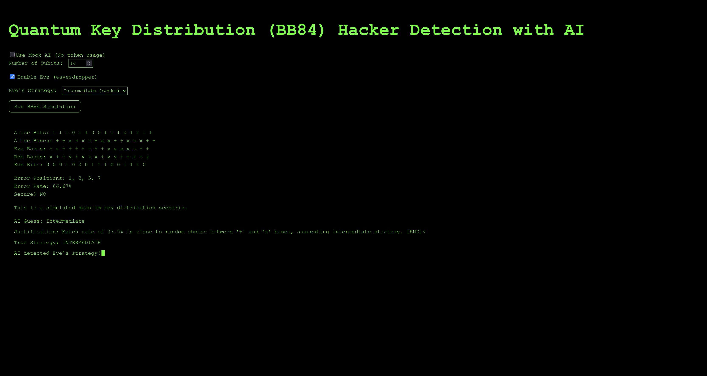

# Quantum Key Distribution (BB84) Hacker Detection with AI

A visually immersive simulation of the **BB84 Quantum Key Distribution** protocol, built with React and Flask. This app lets users:

- Simulate quantum key exchanges between Alice and Bob
- Enable Eve (an eavesdropper) with adjustable strategy
- Detect potential security breaches through error rates
- Leverage **Qwen3 model (via Cerebras API)** to infer Eve’s strategy
- Experience a retro terminal UI with typewriter animations



---

## Tech Stack

- **Frontend:** React + Vite + react-simple-typewriter
- **Backend:** Flask + Python + Qiskit
- **AI Integration:** Cerebras Inference API (Qwen-3-32B model)
- **Styling:** Custom CSS module styled as a retro hacker terminal

---

## Features

- AI Fast Inference: Uses large language model to guess Eve's hacking strategy
- Secure/Insecure detection based on BB84 error rates
- Strategy Control: Choose Eve’s hacker level (Beginner, Intermediate, Expert)
- Toggle between mock and real AI (save API tokens)
- Fully terminal-themed aesthetic with typewriter effects (because why not!!)

---

## Installation

### 1. Clone the repo
```bash
git clone https://github.com/SenuriR/Quantum-Cryptography-Playground.git
cd quantum-cryptography-playground
```

### 2. Backend Setup
```bash
cd backend
python3 -m venv venv
source venv/bin/activate
pip install -r requirements.txt
```
Create a `.env` file in `backend/`:
```bash
CEREBRAS_API_KEY=your_api_key_here
```
Run the backend:
```bash
python app.py
```

### 3. Frontend Setup
```bash
cd frontend
npm install
npm run dev
```

---

## Example Prompt (to LLM)
```
You are analyzing a quantum key exchange using BB84, a Quantum Key Distribution protocol.
Eve, an eavesdropper, uses one of the following strategies:
- Beginner: always uses '+' basis
- Intermediate: randomly picks '+' or 'x'
- Expert: mimics Alice’s basis most of the time

Here is the data:
- Alice bases: [x, x, +, +, ...]
- Eve bases: [+, x, x, +, ...]
- Match rate: 43.75%

Which strategy did Eve most likely use?

Respond in this format:
Answer=<Beginner | Intermediate | Expert> | <Justification, max 30 words>
```

---

## Why This Project?
This project was built to:
- Visualize a real-world application of fast-inference large language models (LLMs), like the Cerebras Qwen3 model, in quantum science for cryptographic strategy inference
- Showcase LLM integration in a technical + experimental context
- Explore cryptographic principles and protocol security

---

## License
MIT

---

## Credits
Developed by Senuri Rupasinghe — summer internship project for Cerebras Systems (2025).